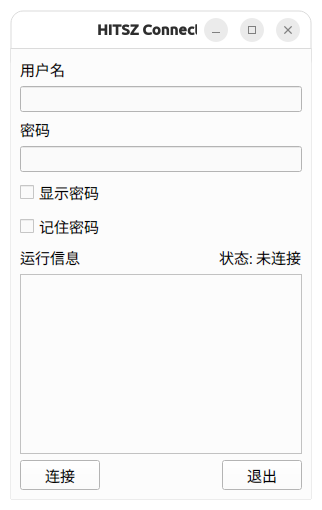

<div align="center">


# HITSZ Connect Verge

[English](README.md) | [中文](README.zh-CN.md)


</div>

## Introduction

HITSZ Connect Verge is a GUI of [ZJU Connect](https://github.com/Mythologyli/zju-connect). It is built for users of ZJU Connect/EasyConnect.


## Features

- Fast and green compared to **EasyConnect**.
- Built with PySide6, easy to build and maintain.
- Multi-platform support, with native optimization for the **macOS** version.
- Works with other applications like Clash, Remote Desktop, and SSH. (See [Working with other applications](#working-with-other-applications))
- Supports custom server address/DNS/HTTP/SOCKS5 proxy port, and keep-alive settings. (If you need additional parameters, please submit an issue/PR)

## Installation

You can install HITSZ Connect Verge in two ways: downloading pre-built binaries or building from source.

> [!NOTE]
>
> 1. If you are a student of HITSZ, username and password are the same as the ones you use to log in to the [Unified Identity Authentic Platform](https://ids.hit.edu.cn).
> 2. If the download speed is slow, you can try using [gh-proxy](https://gh-proxy.com) to download.

### Method 1: Downloading pre-built binaries

HITSZ Connect Verge provides out-of-the-box experience. You can download the latest version from the [release page](https://github.com/kowyo/hitsz-connect-verge/releases/latest).

> [!IMPORTANT]
> For macOS version, you need to grant access to the application by running:
>
> ```bash
> sudo xattr -rd com.apple.quarantine HITSZ\ Connect\ Verge.app
> ```
>
> Or, you can go to macOS `Settings` -> `Security & Privacy` ->
> `Security` -> `Open Anyway` to open the application.

### Method 2: Building from source

1. Clone the repository:

    ```bash
    git clone https://github.com/kowyo/hitsz-connect-verge.git
    cd hitsz-connect-verge
    ```

2. Install dependencies:

    It is strongly recommended to use a virtual environment. You can create a virtual environment by running:

    ```bash
    python -m venv venv
    source venv/bin/activate # activate the virtual environment
    ```

    Then, install the dependencies:

    ```bash
    pip install -r requirements.txt
    ```

3. Run the application:

    ```bash
    python main.py
    ```

4. (Optional) Build the binaries:

    Please refer to our [GitHub Actions workflow](.github/workflows/release.yml) for more information.

## Working with other applications

### Basic information

- **Server**: vpn.hitsz.edu.cn
- **SOCKS5 Proxy**: 1080
- **HTTP Proxy**: 1081
- **DNS Server**: 10.248.98.30

If you want to learn more about the network configuration, you can visit [Mythologyli/zju-connect](https://github.com/Mythologyli/zju-connect).

### Clash

If you want to use Clash at the same time (e.g. watching Youtube and visiting <http://jw.hitsz.edu.cn> at the same time), you can add the following configuration to your clash configuration file.

For example, if you are using [Clash Verge Rev](https://github.com/clash-verge-rev/clash-verge-rev), you can go to 'Profiles' -> Right click on the profile you are using -> 'Edit File' -> Add the following configuration:

```yaml
# note: do not append this to the end of the file directly, append it separately to the corresponding position
proxies:
    # your existing proxies...
    - { name: 'HITSZ Connect Verge', type: socks5, server: 127.0.0.1, port: 1080, udp: true }

proxy-groups:
    # your existing proxy-groups...
    - { name: 校园网, type: select, proxies: ['DIRECT', 'HITSZ Connect Verge']}

rules:
    # your existing rules...
    - 'DOMAIN,vpn.hitsz.edu.cn,DIRECT'
    - 'DOMAIN-SUFFIX,hitsz.edu.cn,校园网'
    - 'IP-CIDR,10.0.0.0/8,校园网,no-resolve'
    # - 'IP-CIDR,<other_ip>,校园网,no-resolve'
```

> [!NOTE]
>
> 1. It is recommended to enable `TUN Mode`
> 2. You need to turn off the `Always use Default Bypass` option in the `System Proxy` settings, and add `localhost` to the `Proxy Bypass` field.

For further information, please refer to [this article](https://oldkingok.cc/share/8bFQXBjOkXt8).

### Remote Desktop

If you want to connect to the remote desktop in the campus network, you can use [Parallels Client](https://www.parallels.com/hk/products/ras/capabilities/parallels-client/), and configure the local 1080 port as a proxy.

### SSH

If you want to use SSH, you can use the following command to establish a connection.

```bash
ssh -o ProxyCommand="nc -X 5 -x 127.0.0.1:1080 %h %p" <your_root>@<your_server>
```

See [this article](https://kuokuo.io/2019/07/01/ssh-over-http-or-socks/) for more information.

## Screenshots

|   Windows   |   Mac   |  Linux   |
| ---- | ---- | ---- |
|     |   |   |

## Contributing

Contributions are welcome! Feel free to open an issue or submit a pull request. For major changes, please open an issue first to discuss what you would like to change.

Also, any typo is welcome to be fixed.

## Related Projects

- [chenx-dust/HITsz-Connect-for-Windows](https://github.com/chenx-dust/HITsz-Connect-for-Windows): HITsz Edition of ZJU-Connect-for-Windows. Support advanced settings and multi-platform.
- [Co-ding-Man/hitsz-connect-for-windows](https://github.com/Co-ding-Man/hitsz-connect-for-windows): Out-of-the-box zju-connect simple GUI for Windows, suitable for HITSZ.

## Credits

- [Mythologyli](https://github.com/Mythologyli) for the project [ZJU Connect](https://github.com/Mythologyli/zju-connect).

- [Keldos](https://github.com/Keldos-Li) for designing the macOS version's icon.

- [EasierConnect](https://github.com/lyc8503/EasierConnect).

- All the contributors to this project.
