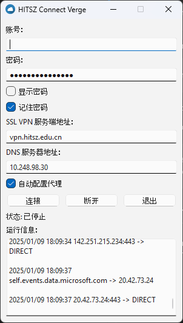
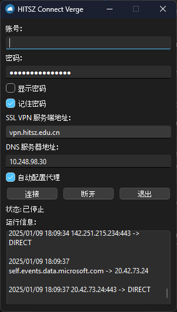

# HITSZ Connect Verge


## Introduction

HITSZ Connect Verge is an application that helps you connect to the campus network of Harbin Institute of Technology, Shenzhen. It is a GUI of [ZJU Connect](https://github.com/Mythologyli/zju-connect) and adapted for the HITSZ network.

## Features

- Fast and green compared to **EasyConnect**.
- Simplified user interface and good-looking icons.
- Built with PySide6 and Python, making it beginner-friendly to contribute and maintain.
- Multi-platform support, providing out-of-box experience without executing additional scripts.

## Installation

You can install HITSZ Connect Verge in two ways: downloading pre-built binaries or building from source.

### Method 1: Downloading pre-built binaries

HITSZ Connect Verge provides out-of-the-box experience. You can download the latest version from the [release page](https://github.com/kowyo/hitsz-connect-verge/releases/latest).

> [!IMPORTANT]
> For macOS version, you need to grant access to the application by running:
>
> ```bash
> sudo xattr -rd com.apple.quarantine hitsz-connect-verge.app
> ```
>
> If some case, you need to go to macOS `Settings` -> `System Preferences` -> 
> `Security & Privacy` -> `Open Anyway`.

### Method 2: Build from source

1. Clone the repository:

    ```bash
    git clone https://github.com/kowyo/hitsz-connect-verge.git
    cd hitsz-connect-verge
    ```

2. Install dependencies:

    It is strongly recommended to use a virtual environment. You can create a virtual environment by running:

    ```bash
    python -m venv venv
    source venv/bin/activate # activate the virtual environment
    ```

    Then, install the dependencies:

    ```bash
    pip install -r requirements.txt
    ```

3. Run the application:

    ```bash
    python main.py
    ```

4. (Optional) Build the binaries:

    You can build the binaries for Windows by running:

    ```bash
    pyinstaller --clean --onefile --noconsole `
    --icon assets/Graphicloads-Colorful-Long-Shadow-Cloud.ico `
    --add-data "assets;assets" `
    --add-data "core/zju-connect;core" `
    -n hitsz-connect-verge main.py
    ```

    For macOS/Linux, you can run the following commands:

    ```bash
    pyinstaller --clean --onefile --noconsole --windowed \
    --icon assets/Graphicloads-Colorful-Long-Shadow-Cloud.icns \
    --add-data "assets:assets" \
    --add-data "core/zju-connect:core" \
    -n hitsz-connect-verge main.py
    ```

## Screenshots

<!-- dark mode and light mode -->
|   Light mode   |   Dark mode   |
| ---- | ---- |
|      |   |

## Contributing

Contributions are welcome! Feel free to open an issue or submit a pull request. For major changes, please open an issue first to discuss what you would like to change.

Also, any typo is welcome to be fixed.
