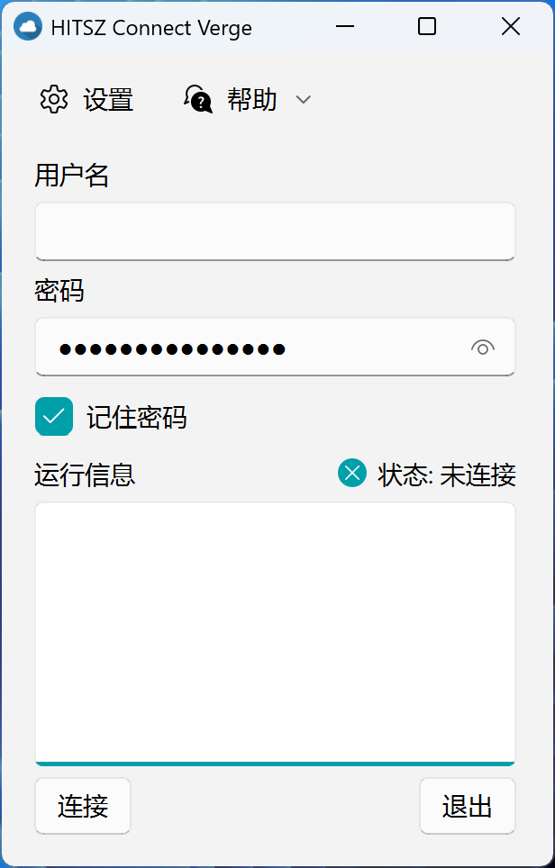
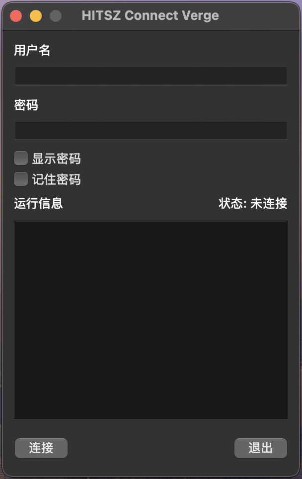

<div align="center">

# HITSZ Connect Verge

[中文](README.zh-CN.md) | [English](README.md)


</div>

## 简介

HITSZ Connect Verge 是 [ZJU Connect](https://github.com/Mythologyli/zju-connect) 的图形用户界面（GUI）。它可以帮助你远程连接到哈尔滨工业大学（深圳）的校园网络。

## 功能特点

- 与 **EasyConnect** 相比，无需安装便可使用，移除后也不会将任何纪录（[注册表](https://zh.wikipedia.org/wiki/注册表)消息等）留在本机电脑上。
- 简洁界面与 Fluent UI 设计（仅Windows平台）
- 基于 PySide6 与 Python 构建，方便贡献者参与维护
- 跨平台支持，开箱即用，无需执行额外脚本
- 可与 Clash、远程桌面、SSH 等应用协同工作（参见[与其他应用协同工作](#与其他应用协同工作)章节）

## 安装指南

您可通过两种方式安装HITSZ Connect Verge：下载预编译版本或从源码构建。

> [!NOTE]
>
> 1. 用户名与密码与[统一身份认证平台](https://ids.hit.edu.cn)的登录凭证相同
> 2. 若下载速度较慢，可尝试使用[gh-proxy](https://gh-proxy.com)进行加速
> 3. Linux版本目前仅支持从源码构建

### 方式一：下载预编译版本

HITSZ Connect Verge提供开箱即用体验，您可从[发布页面](https://github.com/kowyo/hitsz-connect-verge/releases/latest)获取最新版本。

> [!IMPORTANT]
> macOS 版本需通过以下命令授予应用权限：
>
> ```bash
> sudo xattr -rd com.apple.quarantine hitsz-connect-verge.app
> ```
>
> 部分情况下需前往 macOS `设置`->`隐私与安全`->`通用`->`仍要打开`

### 方式二：从源码构建

1. 克隆仓库：

    ```bash
    git clone https://github.com/kowyo/hitsz-connect-verge.git
    cd hitsz-connect-verge
    ```

2. 安装依赖：

    强烈建议使用虚拟环境。可通过以下命令创建：

    ```bash
    python -m venv venv
    source venv/bin/activate # 激活虚拟环境
    ```

    安装依赖项：

    ```bash
    pip install -r requirements.txt
    ```

3. 运行应用：

    ```bash
    python main.py
    ```

4. （可选）构建二进制文件：

    Windows 平台构建命令：

    ```bash
    pyinstaller --clean --onefile --noconsole `
    --icon assets/icon.ico `
    --add-data "assets;assets" `
    --add-data "core/zju-connect;core" `
    -n hitsz-connect-verge main.py
    ```

    macOS/Linux 平台构建命令：

    ```bash
    pyinstaller --clean --onefile --noconsole --windowed \
    --icon assets/icon.icns \
    --add-data "assets:assets" \
    --add-data "core/zju-connect:core" \
    -n hitsz-connect-verge main.py
    ```

## 与其他应用协同工作

### 基础信息

- **服务器地址**: vpn.hitsz.edu.cn
- **SOCKS5代理端口**: 1080
- **HTTP代理端口**: 1081
- **DNS服务器**: 10.248.98.30

如需了解更详细的网络配置信息，请访问[Mythologyli/zju-connect](https://github.com/Mythologyli/zju-connect)。

### Clash 配置

如果您想同时使用 Clash（比如，同时观看 YouTube 和访问 <http://jw.hitsz.edu.cn>），您可以将以下配置添加到您的 Clash 配置文件中。

例如，如果您使用 [Clash Verge Rev](https://github.com/clash-verge-rev/clash-verge-rev)，您可以前往“配置文件” -> 右键单击您正在使用的配置文件 -> “编辑文件” -> 添加以下配置：

```yaml
# 注：请勿将此直接附加到文件末尾，而是分别将其附加到每个配置块的末尾
proxies:
    # 您现有的代理...
    - { name: 'HITSZ 连接边缘', type: socks5, server: 127.0.0.1, port: 1080, udp: true }

proxy-groups:
    # 您现有的代理组...
    - { name: 校园网, type: select, proxies: ['DIRECT', 'HITSZ 连接边缘'] }

proxies:
    # 您现有的规则...
    - 'DOMAIN,vpn.hitsz.edu.cn,DIRECT'
    - 'DOMAIN-SUFFIX,hitsz.edu.cn,校园网'
    - 'IP-CIDR,10.0.0.0/8,校园网,no-resolve'
    # - 'IP-CIDR,<其他_ip>,校园网,no-resolve'

```

> [!NOTE]
>
> 1. 建议启用 `TUN 模式`
> 2. 需要关闭内网绕过代理, 并添加 `localhost` 到`代理绕过设置`区域

更多信息请参考[这篇文章](https://oldkingok.cc/share/8bFQXBjOkXt8)。

### 远程桌面连接

如需接入校园网内的远程桌面，可使用 [Parallels Client](https://www.parallels.com/hk/products/ras/capabilities/parallels-client/)，并将本地 1080 端口配置为代理。

### SSH连接

通过以下命令建立SSH连接：

```bash
ssh -o ProxyCommand="nc -X 5 -x 127.0.0.1:1080 %h %p" <用户名>@<服务器地址>
```

更多信息请参考[此文](https://kuokuo.io/2019/07/01/ssh-over-http-or-socks/)。

## 截图

|   Windows   |   macOS    |   Linux    |
| ---- | ---- | ---- |
|     |   |   |

## 贡献

欢迎贡献代码！您可以通过提交 Issue 或 Pull Request 参与项目。重大修改建议先创建 Issue 讨论。

同时，欢迎修正任何拼写错误。

## 相关项目

- [chenx-dust/HITsz-Connect-for-Windows](https://github.com/chenx-dust/HITsz-Connect-for-Windows)：支持高级设置与多平台的HITsz版ZJU-Connect
- [Co-ding-Man/hitsz-connect-for-windows](https://github.com/Co-ding-Man/hitsz-connect-for-windows)：适用于HITSZ的开箱即用版zju-connect简易GUI